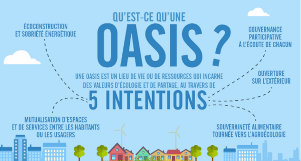

## Qu'est-ce qu'une oasis ?

Une Oasis est un lieu animé par un collectif proposant une alternative à l’habitat individuel dans une démarche écologique. 

En développant notre autonomie via la coopération nous pouvons réduire nos dépendances et nous réapproprier les savoirs permettant de faire face aux grands défis du 21ème siècle. 
Par l’entraide et la solidarité, nous pouvons favoriser la sobriété de nos modes de vie.
Développer la souveraineté alimentaire permet de réduire notre dépendance aux circuits de distribution, la mutualisation des biens permet quant à elle de réduire l’impact écologique du projet.

L’habitat participatif a reçu une définition juridique grâce à la loi n°2014-366 du 24 mars 2014, dite "loi ALUR".
>L’Habitat Participatif est une démarche citoyenne qui permet à des personnes physiques de s’associer, (...) 
>afin de participer à la définition et à la conception de leurs logements et des espaces destinés 
>à un usage commun (…) dans une logique de partage et de solidarité entre habitants

## Qui sommes-nous ?

_Oasis graines d'envies_ est un groupe de citoyens engagés d’horizons variés regroupés autour des enjeux écologiques et sociétaux. 
Nous formons un collectif laïque et ouvert qui a pour projet d'animer une Oasis.

## Notre raison d'être
>Animer un lieu de vie participatif diversifié, solidaire et tolérant, visant à encourager 
>l’éclosion des rêves de chacun par l’émulation du groupe et une entraide réciproque.
>Construire ensemble notre sobriété heureuse.
>Réapprendre les savoir-faire essentiels pour assurer notre autosuffisance alimentaire et 
>énergétique. Faire vivre un écosystème résilient en synergie avec son territoire, 
>pédagogique et inspirant, avec un objectif d’accueil et de partage.